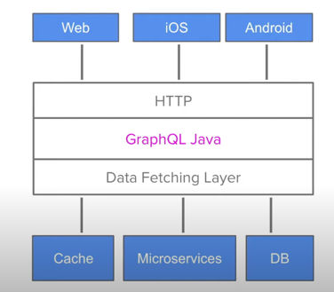

What is GraphQL?

* GraphQL is a technology for client server data exchange
* A clients wants to access data on a server (across a network)
* Originally developed by Facebook for their iOS app in 2012
* Open sourced in 2015, governed by a non-profit foundation today
* Two pillars: statically typed API + query language
* Sweet spots are Single Page Apps and native clients
* An alternative to REST(ish) APIs

